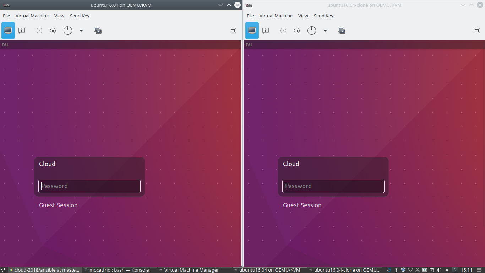
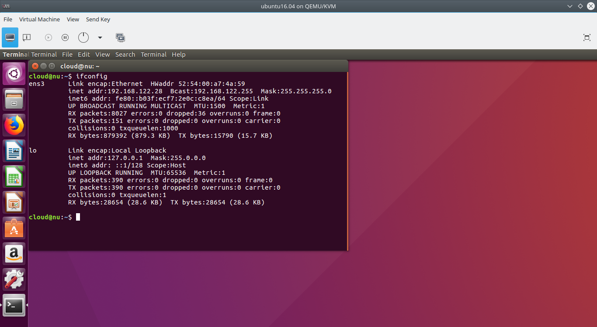
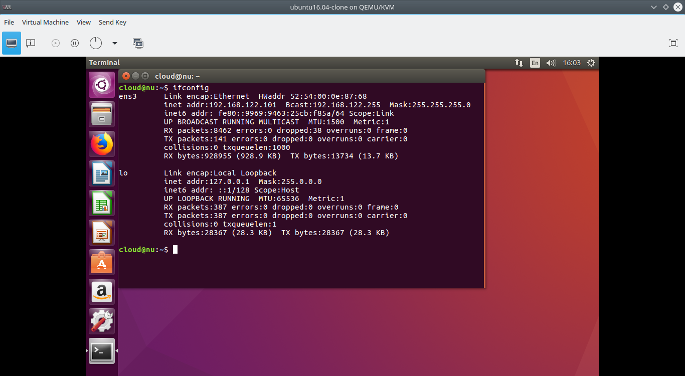

## Dokumentasi Penyelesaian Tugas Ansible
# Deploy Aplikasi Laravel 5.6 menggunakan Ansible

## Langkah 1 - Membuat 3 Virtual Machine
3 VM terdiri dari 2 VM Ubuntu 16.04 sebagai Worker dan 1 VM Debian 9 sebagai DB Server. Dalam hal ini, kami menggunakan aplikasi virtualisasi (**hypervisor**) kategori **full virtualization**, yakni VirtualBox dan KVM.

VirtualBox mungkin sudah tidak asing lagi di telinga kita, namun apa itu KVM?

> Kernel-Based Virtual Machine (KVM) adalah salah satu teknologi virtualisasi (hypervisor) yang dikembangkan oleh Linux.


Kami menggunakan Virtual Machine Manager untuk mengatur KVM yang digunakan.



KVM yang telah diinstall Ubuntu 16.04 yang selanjutnya akan digunakan sebagai worker.

## Langkah 2 - Menambahkan Ansible Inventory

Dengan asumsi kami sudah menginstall **ansible** dan **sshpass** di PC kami, maka kami melakukan langkah-langkah berikut:

1. Membuat folder **Ansible** dan pindah ke dalam folder tersebut.

    ```bash
    mkdir Ansible
    cd Ansible/
    ```
2. Membuat file **hosts** sebagai **file ansible inventory**.
    ```
    nano hosts
    ```
    dengan isi sebagai berikut:

    ```
    worker1 ansible_host=[IP VM 1] ansible_ssh_user=cloud ansible_become_pass=raincloud123!
    worker2 ansible_host=[IP VM 2] ansible_ssh_user=cloud ansible_become_pass=raincloud123!
    ```
    
    **[IP VM 1]** dan **[IP VM 2]** diganti dengan IP masing-masing VM Worker.

    

    

    Sehingga, isi file ```hosts``` menjadi seperti ini:

    ```
    worker1 ansible_host=192.168.122.28 ansible_ssh_user=cloud ansible_become_pass=raincloud123!
    worker2 ansible_host=192.168.122.101 ansible_ssh_user=cloud ansible_become_pass=raincloud123!
    ```
3. Kemudian jalankan perintah dibawah untuk ping VM.

    ```
    ansible -i ./hosts -m ping all -k
    ```
    Keterangan:
    * parameter **-i** : untuk men-declare ansible inventory.
    * parameter **-m** : untuk men-declare module command (dalam hal ini adalah command **ping**).
    * parameter **all** : untuk penanda ansible dijalankan di host mana. Parameter **all** bisa diganti dengan nama host.
    * parameter **-k** : untuk menanyakan password login ssh.

    

    Yeay ping-nya sukses!

## Langkah 3 - Grouping Host

Membuka file ```hosts``` dan menambahkan nama group dalam tanda **[ ]**. Dalam hal ini, kami memberi nama group **worker**.

```
[worker]
worker1 ansible_host=192.168.122.28 ansible_ssh_user=cloud ansible_become_pass=raincloud123!
worker2 ansible_host=192.168.122.101 ansible_ssh_user=cloud ansible_become_pass=raincloud123!
```

## Langkah 4 - Instalasi Software Pendukung

Software yang dibutuhkan untuk menjalankan Aplikasi Laravel 5.6 adalah:

    * Nginx
    * PHP 7.2
    * Composer
    * Git

Seluruh software tersebut akan diinstall pada hosts **worker** menggunakan file **yml**. Dalam dunia per-ansible-an, kita menyebutnya sebagai **playbook**.

1. Membuat playbook baru bernama **laravel.yml**.

    ```
    nano laravel.yml
    ```
2. Menuliskan script berikut:

    ```yml
    ---
    - hosts: worker
      tasks:
        
        # INSTALL YG DIBUTUHKAN SELAIN PHP
        - name: Install Nginx, Git, Zip, Unzip, dll
          become: true
          apt:
            name: "{{ item }}"
            state: latest
            update_cache: true
          with_items:
            - nginx
            - git
            - python-software-properties
            - software-properties-common
            - zip
            - unzip
          notify:
            - Stop nginx
            - Start nginx

        # INSTALL PHP 7.2
        - name: Tambah PHP 7 PPA Repository
          become: true
          apt_repository:
            repo: 'ppa:ondrej/php'
            update_cache: true

        - name: Install PHP 7.2 Packages
          become: yes
          apt: 
            name: "{{ item }}"
            state: latest
          with_items:
            - php7.2
            - php-pear
            - php7.2-curl
            - php7.2-dev
            - php7.2-gd
            - php7.2-mbstring
            - php7.2-zip
            - php7.2-mysql
            - php7.2-xml
            - php7.2-intl
            - php7.2-json
            - php7.2-cli
            - php7.2-common
            - php7.2-fpm
          notify:
            - Restart PHP-fpm

    handlers:
        - name: Restart nginx
          become: true
          service:
            name: nginx
            state: restarted

        - name: Stop nginx
          become: true
          service:
            name: nginx
            state: stopped

        - name: Start nginx
          become: true
          service:
            name: nginx
            state: started

        - name: Restart PHP-fpm
          become: true
          service:
            name: php7.2-fpm
            state: restarted
    ```
    Keterangan:
    
    * Variable ```item``` yang berada dalam tanda **jinja** "{{ }}" digantikan dengan ```with_items```. 
    * **Zip** dan **unzip** diinstall karena kedepannya akan digunakan untuk menginstall Composer supaya prosesnya lebih cepat.
    * Proses menginstall **PHP 7.2** adalah harus terlebih dulu menginstall ```python-software-properties```, menambah repo, kemudian baru bisa menginstall php 7.2 beserta packages2nya.
    * ```Handlers``` digunakan untuk mendefinisikan task yang dipanggil di modul ```notify```, biasanya terkait dengan **restart service**. Kami tuliskan pula **stop** dan **start** hanya untuk sekadar jaga-jaga.

## Langkah 5 - Clone Git yang Berisi Aplikasi Laravel

Membuka ```laravel.yml``` dan memasukkan script berikut:

```yml
    # CLONE GIT
    - name: Bikin direktori
      become: true
      file:
        path: "{{ laravel_root_dir }}"
        state: directory
        owner: "{{ ansible_ssh_user }}"
        group: "{{ ansible_ssh_user }}"
        recurse: yes

    - name: Clone git
      git:
        dest: "{{ laravel_root_dir }}"
        repo: https://github.com/udinIMM/Hackathon.git
        force: yes
```
Keterangan:

* Variable ```laravel_root_dir``` diganti dengan ```/var/www/laravel``` yang nantinya akan di-declare di modul ```vars```.
* Variable ```ansible_ssh_user``` diganti sesuai dengan yang ada pada file ```hosts``` yang dalam hal ini adalah ```cloud```.

## Langkah 6 - Instalasi Composer dan Setting Environment Laravel

1. Membuka ```laravel.yml``` dan memasukkan script berikut:

    ```yml
        # INSTALL COMPOSER
        - name: Download Composer
          script: scripts/install_composer.sh

        - name: Setting composer jadi global
          become: true
          command: mv composer.phar /usr/local/bin/composer

        - name: Set permission composer
          become: true
          file:
            path: /usr/local/bin/composer
            mode: "a+x"

        - name: Install dependencies laravel
          composer:
            working_dir: "{{ laravel_root_dir }}"
            no_dev: no
        
        # SETTING ENVIRONMENT
        - name: Bikin .env
          command: cp "{{ laravel_root_dir }}/.env.example" "{{ laravel_root_dir }}/.env"
        
        - name: php artisan key generate
          command: php "{{ laravel_root_dir }}/artisan" key:generate

        - name: php artisan clear cache
          command: php "{{ laravel_root_dir }}/artisan" cache:clear
        
        - name: set APP_DEBUG=false
          lineinfile: 
            dest: "{{ laravel_root_dir }}/.env"
            regexp: '^APP_DEBUG='
            line: APP_DEBUG=false

        - name: set APP_ENV=production
          lineinfile: 
            dest: "{{ laravel_root_dir }}/.env"
            regexp: '^APP_ENV='
            line: APP_ENV=production

        - name: set DB connection
          lineinfile: 
            dest: "{{ laravel_root_dir }}/.env"
            regexp: '^DB_HOST='
            line: DB_HOST=ipku

        - name: set DB name
          lineinfile: 
            dest: "{{ laravel_root_dir }}/.env"
            regexp: '^DB_DATABASE='
            line: DB_DATABASE=hackathon

        - name: set DB username
          lineinfile: 
            dest: "{{ laravel_root_dir }}/.env"
            regexp: '^DB_USERNAME='
            line: DB_USERNAME=regal

        - name: set DB password
          lineinfile: 
            dest: "{{ laravel_root_dir }}/.env"
            regexp: '^DB_PASSWORD='
            line: DB_PASSWORD=bolaubi

        - name: Ganti permission bootstrap/cache directory
          file:
            path: "{{ laravel_cache_dir }}"
            state: directory
            mode: "a+x"

        - name: Ganti permission vendor directory
          command: chmod -R 777 "{{ laravel_vendor_dir }}"

        - name: Ganti permission storage directory
          command: chmod -R 777 "{{ laravel_storage_dir }}" 
    ```
    Keterangan:

    * Kami menginstall **Composer** menggunakan script yang disimpan dalam ```scripts/install_composer.sh```.
    * Variable ```laravel_cache_dir``` diganti dengan ```/var/www/laravel/bootstrap/cache``` yang nantinya akan di-declare di modul ```vars```.
    * Variable ```laravel_vendor_dir``` diganti dengan ```/var/www/laravel/vendor``` yang nantinya akan di-declare di modul ```vars```.
    * Variable ```laravel_storage_dir``` diganti dengan ```/var/www/laravel/storage``` yang nantinya akan di-declare di modul ```vars```.
    
2. Membuat file ```install_composer.sh``` dalam folder ```scripts```.

    ```bash
    mkdir scripts
    cd scripts/
    nano install_composer.sh
    ```
    dan isikan script berikut:
    
    ```bash
    #!/bin/sh

    EXPECTED_SIGNATURE=$(wget -q -O - https://composer.github.io/installer.sig)
    php -r "copy('https://getcomposer.org/installer', 'composer-setup.php');"
    ACTUAL_SIGNATURE=$(php -r "echo hash_file('SHA384', 'composer-setup.php');")

    if [ "$EXPECTED_SIGNATURE" != "$ACTUAL_SIGNATURE" ]
    then
        >&2 echo 'ERROR: Invalid installer signature'
        rm composer-setup.php
        exit 1
    fi

    php composer-setup.php --quiet
    RESULT=$?
    rm composer-setup.php
    exit $RESULT
    ```

## Langkah 7 - Konfigurasi Nginx

1. Membuat file konfigurasi nginx bernama ```nginx.conf``` dalam folder ```templates```.

    ```bash
    mkdir templates
    cd templates/
    nano nginx.conf
    ```
    dan mengisikan config sebagai berikut

    ```nginx
    server {
        listen 80 default_server;
        listen [::]:80 default_server;
        
        root {{ laravel_web_dir }};

        index index.php;

        server_name {{ inventory_hostname }};

        location / {
            try_files $uri $uri/ =404;
        }

        location ~ \.php$ {
            try_files $uri /index.php =404;
            fastcgi_split_path_info ^(.+\.php)(/.+)$;
            fastcgi_pass unix:/var/run/php/php7.2-fpm.sock;
            fastcgi_index index.php;
            fastcgi_param SCRIPT_FILENAME $document_root$fastcgi_script_name;
            include fastcgi_params;
        }

        error_log /var/log/nginx/{{ inventory_hostname }}_error.log;
        access_log /var/log/nginx/{{ inventory_hostname }}_access.log;
    }
    ```

    Keterangan:

    * Variable ```laravel_web_dir``` diganti dengan ```/var/www/laravel/public``` yang nantinya akan di-declare di modul ```vars```.
    * Variable ```inventory_hostname``` diganti sesuai dengan yang ada pada file ```hosts``` yang dalam hal ini adalah ```worker1``` dan ```worker2```.

2. Kemudian membuka ```laravel.yml``` dan memasukkan script berikut:

    ```yml
        # CONFIG NGINX
        - name: Configure Nginx
          become: true
          template:
            src: templates/nginx.conf
            dest: "{{ nginx_conf_dir }}/sites-enabled/default"
          notify:
            - Restart nginx
            - Restart PHP-fpm
    ```
## Langkah 8 - Mendeclare Vars

Membuka ```laravel.yml``` dan memasukkan script berikut dibawah modul ```Hosts``` baris paling pertama.

```yml
vars:
    laravel_root_dir: /var/www/laravel
    laravel_web_dir: "{{ laravel_root_dir }}/public"
    laravel_cache_dir: "{{ laravel_root_dir }}/bootstrap/cache"
    laravel_vendor_dir: "{{ laravel_root_dir }}/vendor"
    laravel_storage_dir: "{{ laravel_root_dir }}/storage"
    nginx_conf_dir: /etc/nginx
```
```Vars``` digunakan untuk mendeclare seluruh variable yang digunakan didalam script.

## Langkah 9 - Menyatukan Playbook

Sehingga jika disatukan, maka playbooknya akan terlihat seperti ini :

```yml
---
- hosts: worker

  vars:
    laravel_root_dir: /var/www/laravel
    laravel_web_dir: "{{ laravel_root_dir }}/public"
    laravel_cache_dir: "{{ laravel_root_dir }}/bootstrap/cache"
    laravel_vendor_dir: "{{ laravel_root_dir }}/vendor"
    laravel_storage_dir: "{{ laravel_root_dir }}/storage"
    nginx_conf_dir: /etc/nginx

  tasks:

    # INSTALL YG DIBUTUHKAN SELAIN PHP
    - name: Install Nginx, Git, Zip, Unzip, dll
      become: true
      apt:
        name: "{{ item }}"
        state: latest
        update_cache: true
      with_items:
        - nginx
        - git
        - python-software-properties
        - software-properties-common
        - zip
        - unzip
      notify: 
        - Stop nginx
        - Start nginx

    # INSTALL PHP 7.2
    - name: Tambah PHP 7 PPA Repository
      become: true
      apt_repository:
        repo: 'ppa:ondrej/php' 
        update_cache: true

    - name: Install PHP 7.2 Packages
      become: yes
      apt: 
        name: "{{ item }}"
        state: latest
      with_items:
        - php7.2
        - php-pear
        - php7.2-curl
        - php7.2-dev
        - php7.2-gd
        - php7.2-mbstring
        - php7.2-zip
        - php7.2-mysql
        - php7.2-xml
        - php7.2-intl
        - php7.2-json
        - php7.2-cli
        - php7.2-common
        - php7.2-fpm
      notify: 
        - Restart PHP-fpm
    
    # CLONE GIT
    - name: Bikin direktori
      become: true
      file:
          path: "{{ laravel_root_dir }}"
          state: directory
          owner: "{{ ansible_ssh_user }}"
          group: "{{ ansible_ssh_user }}"
          recurse: yes

    - name: Clone git
      git:
        dest: "{{ laravel_root_dir }}"
        repo: https://github.com/udinIMM/Hackathon.git
        force: yes

    # INSTALL COMPOSER
    - name: Download Composer
      script: scripts/install_composer.sh

    - name: Setting composer jadi global
      become: true
      command: mv composer.phar /usr/local/bin/composer

    - name: Set permission composer
      become: true
      file:
        path: /usr/local/bin/composer
        mode: "a+x"

    - name: Install dependencies laravel
      composer:
        working_dir: "{{ laravel_root_dir }}"
        no_dev: no
    
    # SETTING ENVIRONMENT
    - name: Bikin .env
      command: cp "{{ laravel_root_dir }}/.env.example" "{{ laravel_root_dir }}/.env"
    
    - name: php artisan key generate
      command: php "{{ laravel_root_dir }}/artisan" key:generate

    - name: php artisan clear cache
      command: php "{{ laravel_root_dir }}/artisan" cache:clear
    
    - name: set APP_DEBUG=false
      lineinfile: 
        dest: "{{ laravel_root_dir }}/.env"
        regexp: '^APP_DEBUG='
        line: APP_DEBUG=false

    - name: set APP_ENV=production
      lineinfile: 
        dest: "{{ laravel_root_dir }}/.env"
        regexp: '^APP_ENV='
        line: APP_ENV=production

    - name: Ganti permission bootstrap/cache directory
      file:
        path: "{{ laravel_cache_dir }}"
        state: directory
        mode: "a+x"

    - name: Ganti permission vendor directory
      command: chmod -R 777 "{{ laravel_vendor_dir }}"

    - name: Ganti permission storage directory
      command: chmod -R 777 "{{ laravel_storage_dir }}"
    
    # CONFIG NGINX
    - name: Configure Nginx
      become: true
      template:
        src: templates/nginx.conf
        dest: "{{ nginx_conf_dir }}/sites-enabled/default"
      notify:
        - Restart nginx
        - Restart PHP-fpm

  handlers:
    - name: Restart nginx
      become: true
      service: 
        name: nginx
        state: restarted

    - name: Stop nginx
      become: true
      service: 
        name: nginx
        state: stopped

    - name: Start nginx
      become: true
      service: 
        name: nginx
        state: started

    - name: Restart PHP-fpm
      become: true
      service: 
        name: php7.2-fpm
        state: restarted
```

## Langkah 10 - TESTING BROH!

1. Menjalankan perintah

    ```
    ansible-playbook -i hosts laravel.yml -k
    ```

2. Jika error, baca errornya dan perbaiki (mungkin indentasi, spasi dan tabnya). Jika sukses, maka lanjutkan testing di browser.

    Keterangan:

    * Jika muak dengan si **cowsay**, matikan saja sapinya dengan cara ```export ANSIBLE_NOCOWS="1"``` 

3. Ketikkan alamat IP VM Worker di browser, yang dalam hal ini adalah ```192.168.122.28``` dan ```192.168.122.101```.


YEAY! Berhasil

# Script

[Sebuah script](https://github.com/nahdazahra/cloud2018/tree/master/Ansible/Ansible)


# Thanks to!

* [How To Deploy a Basic PHP Application Using Ansible on Ubuntu 14.04](https://www.digitalocean.com/community/tutorials/how-to-deploy-a-basic-php-application-using-ansible-on-ubuntu-14-04#step-7-%E2%80%94-configuring-nginx)
* [Hello Ansible! - Tutorial Ansible](https://knpuniversity.com/screencast/ansible/ansible-intro)
* [Dokumentasi Laravel](https://laravel.com/docs/5.0)

p.s. Jika ingin lebih paham ansible, bisa belajar lagi dari link di atas karena dijelaskan step-by-step nya secara lebih ditel
