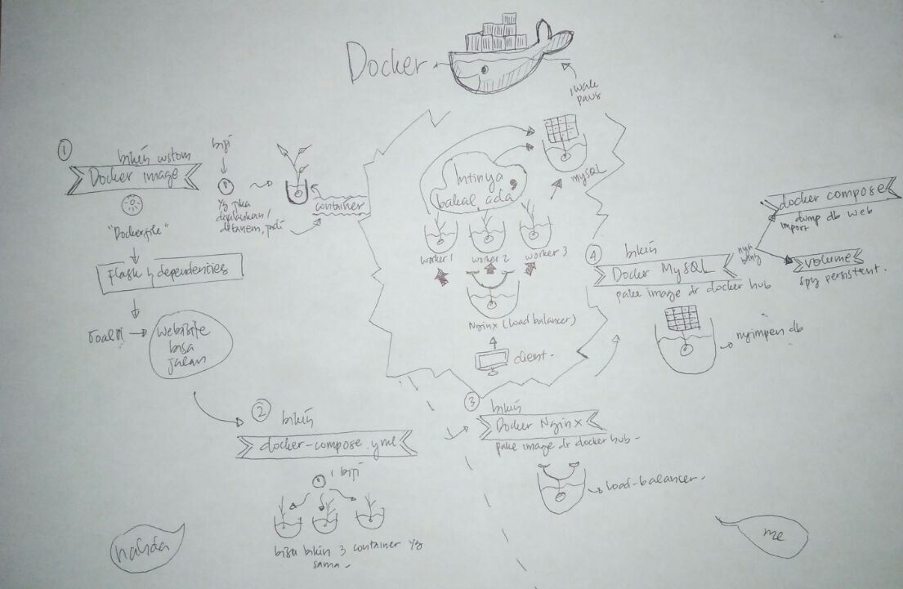
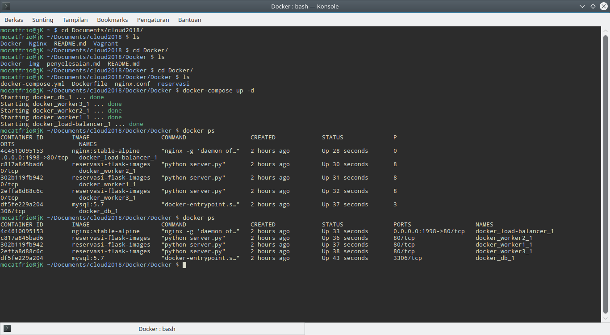
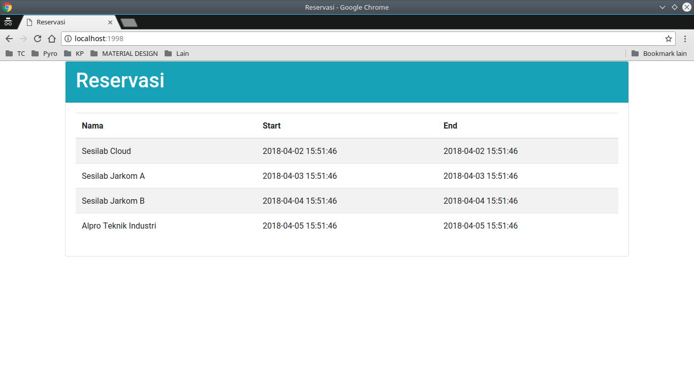

## Dokumentasi Penyelesaian Tugas Docker
# Deploy Aplikasi Python Flask menggunakan Docker, Nginx sebagai Load Balancer dan MySQL sebagai Database

Dalam menyelesaikan permasalahan tersebut, ada beberapa langkah-langkah yang harus dilakukan. Secara garis besar, seperti ini:

1. Membuat custom image container **python flask** sebagai worker
2. Membuat image container **nginx** sebagai load-balancer (boleh menggunakan yang sudah ada di Docker Hub)
3. Membuat image container **mysql** sebagai database (boleh menggunakan yang sudah ada di Docker Hub)
4. Membuat **docker-compose.yml** untuk menyatukan mereka bertiga supaya bisa dijalankan bersama-sama

Untuk lebih jelasnya, dapat dilihat pada ilustrasi di bawah ini



## Langkah-langkah

1. Membuat ``Dockerfile`` untuk custom image container python flask. Nantinya, image ini akan digunakan sebagai Worker.
   
    ```dockerfile
    # Pull base image
    FROM ubuntu:16.04

    # Install python dan dependencies-nya untuk menjalankan aplikasi Flask
    RUN apt-get update -y
    RUN apt-get -y upgrade
    RUN apt-get install -y libmysqlclient-dev python-dev python-pip build-essential libssl-dev libffi-dev
    RUN apt-get install -y wget apt-utils zip python2.7 
    RUN pip install --upgrade pip

    # Download Web Reservasi lab yang dibuat menggunakan python flask
    RUN wget https://cloud.fathoniadi.my.id/reservasi.zip 
    RUN unzip reservasi.zip
    RUN mv reservasi reservasi-flask

    # Berpindah direktori 
    WORKDIR reservasi-flask

    # Install dependencies untuk web flask
    RUN pip install -r req.txt

    # Menjalankan python saat docker dijalankan
    ENTRYPOINT ["python"]

    # Menjalankan server.py
    CMD ["server.py"]

    # Port 80
    EXPOSE 80
    ```
2. Jangan lupa melakukan **build** untuk membuat imagenya.
    
    ```docker
    docker build -t reservasi-flask-images ./
    ```

3. Karena image container **nginx** dan **mysql** menggunakan image container yang sudah jadi dan ada di Docker Hub, maka kami langsung membuat ``docker-compose.yml``.

    ```yml
    version: '3.3'

    services:
        db:
            image: mysql:5.7
            restart: always
            environment:
                MYSQL_ROOT_PASSWORD: buayakecil
                MYSQL_DATABASE: reservasi
                MYSQL_USER: userawan
                MYSQL_PASSWORD: buayakecil
            volumes:
                - ./reservasi:/docker-entrypoint-initdb.d
                - dbdata:/var/lib/mysql
            networks:
                ip-docker:
                    ipv4_address: 10.5.5.5

        worker1:
            image: reservasi-flask-images
            depends_on:
                - db
            restart: always
            environment: 
                DB_HOST: 10.5.5.5
                DB_USERNAME: userawan
                DB_PASSWORD: buayakecil
                DB_NAME: reservasi
            networks:
                ip-docker:
                    ipv4_address: 10.5.5.10

        worker2:
            image: reservasi-flask-images
            depends_on:
                - db
            restart: always
            environment: 
                DB_HOST: 10.5.5.5
                DB_USERNAME: userawan
                DB_PASSWORD: buayakecil
                DB_NAME: reservasi
            networks:
                ip-docker:
                    ipv4_address: 10.5.5.11

        worker3:
            image: reservasi-flask-images
            depends_on:
                - db
            restart: always
            environment:
                DB_HOST: 10.5.5.5
                DB_USERNAME: userawan
                DB_PASSWORD: buayakecil
                DB_NAME: reservasi
            networks:
                ip-docker:
                    ipv4_address: 10.5.5.12
    
        load-balancer:
            image: nginx:stable-alpine
            depends_on:
                - worker1
                - worker2
                - worker3
            volumes:
                - ./nginx.conf:/etc/nginx/conf.d/default.conf:ro
            ports:
                - 1998:80
            networks: 
                ip-docker:
                    ipv4_address: 10.5.5.6

    volumes:
        dbdata:

    networks: 
        ip-docker:
            driver: bridge
            ipam: 
                config:
                    - subnet: 10.5.5.0/24
    ```

    Keterangan:

    * Membuat service database dengan nama ``db`` menggunakan image yang sudah ada di Docker Hub ``mysql:5.7``, serta mengatur seluruh setup environmet mysql, import dump database web, dan setup volume agar storage mysql menjadi persisten
    * Membuat service 3 node worker dengan nama ``worker1``, ``worker2``, ``worker3`` menggunakan image python flask yang tadi telah dibuat dengan nama ``reservasi-flask-images``
    * Membuat service load balancer dengan nama ``load-balancer`` menggunakan image yang sudah ada di Docker Hub ``nginx:stable-alpine``, serta membuat konfigurasi load balancer dengan nama ``nginx.conf`` sebagai berikut:

        ```conf
        upstream worker {
            server 10.5.5.10;
            server 10.5.5.11;
            server 10.5.5.12;
        }

        server {
            listen  80 default_server;
            location / {
                proxy_pass http://worker;
            }
        }
        ```

    * Masing masing container diberi IP statis untuk mempermudah.

4. Jalankan ``docker-compose.yml`` dengan melakukan perintah

    ```
    docker-compose up -d
    ```

    pada level direktori yang sama dengan direktori ``docker-compose.yml``. Lalu cek dengan menggunakan ``docker ps``.

    

5. Cek pada browser

    ```
    localhost:1998
    ```
    
    Maka akan muncul tampilan web seperti dibawah ini:

    

YAY SELESAI!

Sehingga, isi dari direktori docker kami adalah sebagai berikut:


